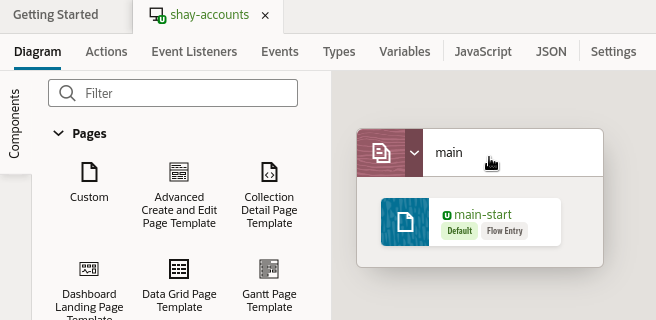
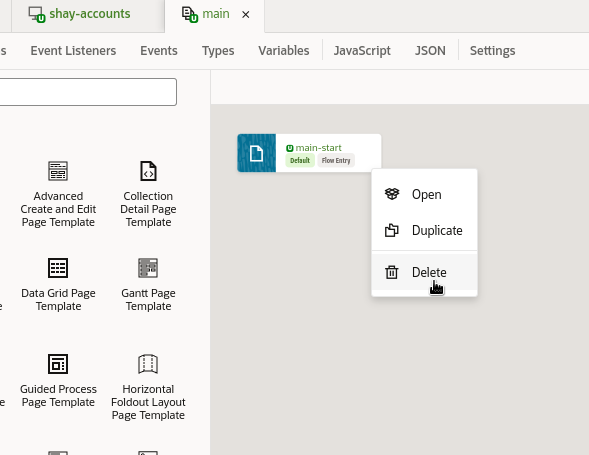
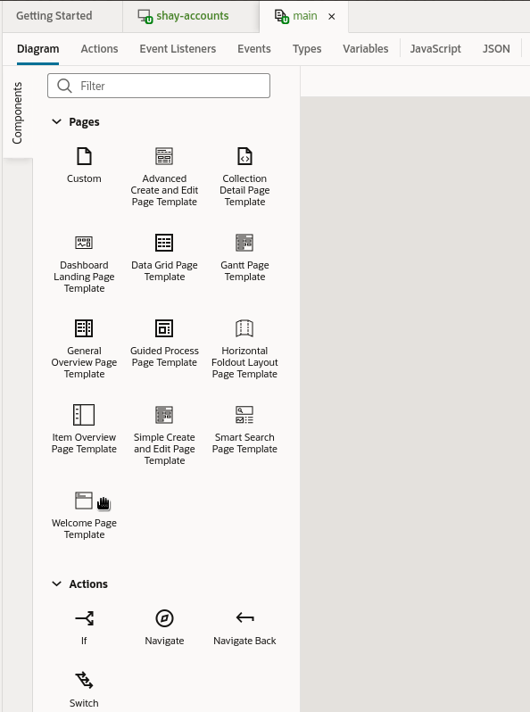
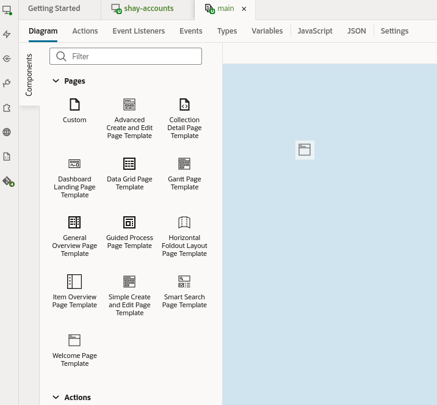
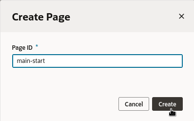

# Create Pages from Templates

## Introduction

In this lab we'll create a new application and add pages built from Redwood Page Templates.  Redwood page templates improve the user experience of working with our pages. The Redwood templates not only provide a consistent look and feel across the pages in our app, but we'll also be able to leverage the usability features they offer.

Estimated Time: 5 minutes

About the Oracle Redwood User Experience
The Redwood User Experience is a collective reinvention of how Oracle customers interact with technology and consume information. While Redwood includes a beautiful new set of user interface elements, including the templates you'll work with in this lab, it's also a philosophical approach to solving customer problems in a differentiated and satisfying way.

### Objectives

In this lab, you will:

* Create a welcome page using the Redwood Welcome Page Template
* Create an account details page using the Horizontal Foldout Layout Page Template
* Create an account edit page using the Simple Create and Edit Page Template

**Tip:** In the header area (the black bar along the top), you'll also find the Undo and Redo buttons, which look like this:

  

If you make a mistake during this lab, click Undo to back out of the last step you did.

## Task 1: Create an App UI

You should now be in the Designer, VB Studio's visual editor. We'll start by creating an *App UI*, which is simply an application that includes a user interface component in the form of Visual Builder pages and flows. With App UIs, you can create new interfaces that address specific business needs for your company.

1. On the left side of the Designer's navigator, click the first tab, App UIs, click **+ App UI**:

  

2. In the Create App UI dialog, provide a name in the form **YourName-Accounts**, then click **Create**:

  

In the Diagram view on the right, you can see the flows and pages for this App UI. A flow contains pages that relate to each other. An application can contain multiple flows, and a flow can contain many pages. In this case we have one flow, *main*, and one page, *main-start*:

  

## Task 2: Add a Welcome Page as the New Default Page

You should be in the Diagram tab with the Components open.

1. Double-click  **main** to open its flow diagram:

  

You are going to replace the main-start page with one that uses a Redwood template, so the existing one can be deleted.

2. Right-click on the main-start page, select **Delete**:

  

In the Components tab you will see a page named **Welcome Page Template**.  If you do not see this template, go back to the first lab and make sure you have all of the components installed.

  

3. Drag the **Welcome Page Template** into the diagram editor:

  

4. Name the new page **main-start**, then click **Create**:

  

## Task 3: Add a Details Page

You should be in the Diagram tab with the Components open.

In the Components tab you will see a page named **Horizontal Foldout Layout Page Template**.  If you do not see this template, go back to the first lab and make sure you have all of the components installed.

  

1. Drag the **Horizontal Foldout Layout Page Template** into the diagram editor:

  

2. Name the new page **main-accounts-detail**, then click **Create**:

  

## Task 4: Add an Edit Page

You should be in the Diagram tab with the Components open.

In the Components tab you will see a page named **Simple Create and Edit Page Template**.  If you do not see this template, go back to the first lab and make sure you have all of the components installed.

  

1. Drag the **Simple Create and Edit Page Template** into the diagram editor:

  

2. Name the new page **main-edit-accounts**, then click **Create**:

  

Next you will configure a variable to work as an input parameter for the edit page.

3. Double-click **main-edit-accounts** to open the page:

  

4. Switch to the **variables** tab:

  

5. In the list of variables, click on **objectId**:

  

6. In the properties on the right set **Input Parameter** to **Required**:

  

You now have three pages created for your application.

Let's move on to the next lab, where we'll learn how to configure the Welcome page.

You may now **proceed to the next lab**.

## Learn More

* [Use the Page Designer](https://docs.oracle.com/en/cloud/paas/visual-builder/visualbuilder-building-appui/get-started1.html#GUID-CC2B203D-51D3-4408-8D0B-4E26C86BCBC0)
* [Oracle JET](http://oracle.com/jet)

## Acknowledgements
* **Author** - Shay Shmeltzer, Oracle Cloud Development Tools, August 2022
* **Contributors** -  Marcie Caccamo, Blaine Carter, Oracle Cloud Development Tools
* **Last Updated By/Date** - Blaine Carter, Oracle Cloud Development Tools, May 2023
