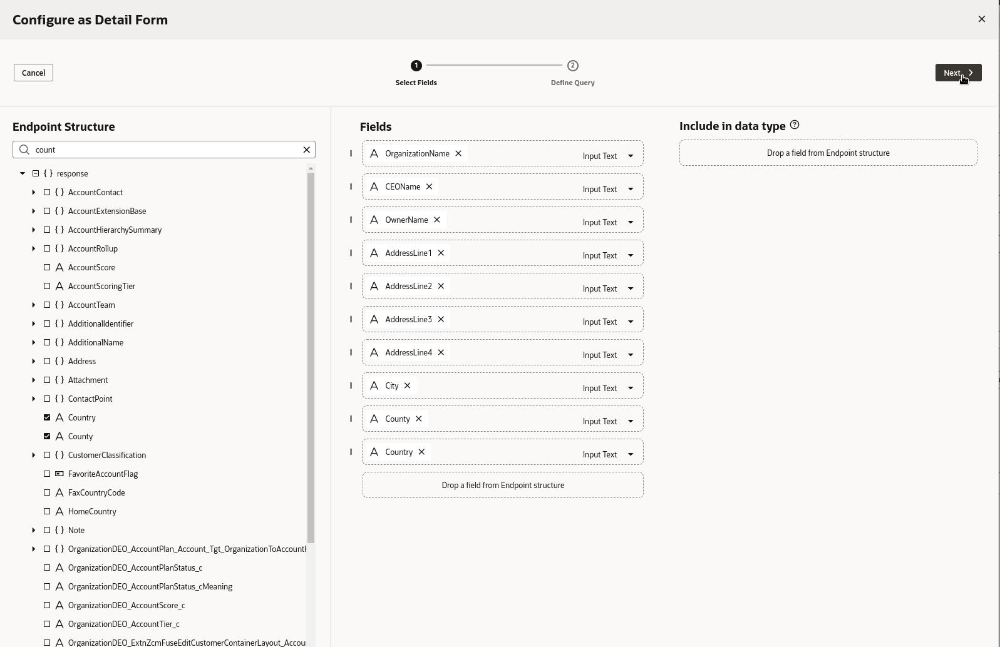

# Account Details Page

## Introduction

In this lab we'll complete the details page.  We created this page earlier using the **Horizontal Foldout Layout Page Template** to improve the user experience.

Estimated Time: 20 minutes

### Objectives

In this lab, you will:

* Configure Redwood page template variables
* Add data to the details page
* Use the Foldout template

## Task 1: Configure Redwood page template variables

1. Starting in the main-start page in the **Page Designer** tab, click the **Live** button:

	

	Live mode allows you to interact with your app as if it were actually running.

2. Click the info icon for one of the rows.

	The Details page opens.  This page uses the Redwood **Horizontal Foldout Layout Page Template**.

A pattern or template applies more than just a new look and feel to the user interface; it can add variables and actions to your page as well. In the Properties pane, notice that many template properties have been mapped to variables, but they may not be the values we want. To change the values of these properties, we'll need to update the variables' default values.

3. In the row containing the **Page Designer** tab, click **Variables**:

	  

4. Locate each of these variables, then modify its **Default Value** property as shown here. (You don't have to save anything between modifications.)

	|Variable |Default Value |
	| --- | --- |
	|pageTitle | Account Info |
	|panelOneTitle| Company |
	|panelTwoTitle | Address |
	|biDirectionalNavigation | false |
	{: title="Default values for page variables"}

	Here's a sample screenshot for the pageTitle variable:

	  

3. Switch back to the **Page Designer** tab click **Design** so you can edit the page:

  

Notice the template includes a button to take you back to the parent page.  You already configured this when you mapped the parameters in the navigate action chain.

## Task 2: Add Account data to the template

1. In the Designer, click the **Data** tab on the left and expand the Services node until you can see the **accounts** service. (If you don't see any services, click the Refresh icon next to the Filter box at the top of the pane.)
	  

2. Drag the accounts service to the Structure pane and drop it onto the first **div** in the first **Summarizing Foldout Panel**:
	  

3. In the **Render as** pop-up, choose **Detail** (not Detail Dynamic, the first option):
	  

4. On the **Configure as Detail Form** Page, use the filter field to search for and select these fields:

	* OrganizationName
	* CEOName
	* OwnerName
	* AddressLine1
	* AddressLine2
	* AddressLine3
	* AddressLine4
	* City
	* County
	* Country

  

	These are the fields that will provide more information about the selected record (that is, an individual account).

5. Click **Next**

6.  Drag **rowIndex** onto **accounts_id**.  You already configured rowIndex when you mapped the parameters in the navigate action chain.

  

7. Click **Finish** to return to the details page:
  

	Your page content should be displayed in the first panel (if you don't see the data refresh the layout.). However, we're displaying too much information in this panel, so let's move some of it to the next panel.

## Task 3: Display the data across both foldout sections

1. In the Components palette, find the **Form Layout** component:
	  

2. Drag it to the second **Summarizing Foldout Panel** and drop it onto the first **div**:
		

3. In the Structure pane select, click the fourth field in the Form Layout, and **Shift-select** all the other fields after that. Drag all of them into the new **Form Layout** you created in the second **Summarizing Foldout Panel**:
	  

4. Your app should now look something like this.
	  

5. Use the **Parent page** button to switch back to the **main-start** page, then click **Preview** in the header to see your app live.

You may now close the preview browser tab and **proceed to the next lab**.

## Learn More

* [Oracle Visual Builder Studio](https://docs.oracle.com/en/cloud/paas/visual-builder/index.html)

## Acknowledgements
* **Author** - Shay Shmeltzer, Oracle Cloud Development Tools, September 2022
* **Contributors** -  Marcie Caccamo, Blaine Carter, Oracle Cloud Development Tools
* **Last Updated By/Date** - Blaine Carter, Oracle Cloud Development Tools, March 2023
