# Edit Account Page

## Introduction

In this lab we'll complete the edit account page, so your users can manipulate the data coming from Oracle Fusion Cloud Apps.  We created this page earlier using the **Simple Create and Edit Page Template**.

Estimated Time: 10 minutes

### Objectives

In this lab, you will:
* Set some page template properties
* Add data to the page
* Re-Configure the save button
* Modify an action chain

## Task 1: Update Template Properties

When your account managers locate an account using our new page, it's quite possible that they may need to update the account data or insert new information as well. In this task we'll modify the page created earlier to let them do that.

1. Starting in the main-start page in the **Page Designer** tab, click the **Live** button:

	

	Live mode allows you to interact with your app as if it were actually running.

2. Click the edit icon for one of the rows.

	The edit account page opens.  This page uses the Redwood **Simple Create and Edit Page Template**.

A pattern or template applies more than just a new look and feel to the user interface; it can add variables and actions to your page as well. We will set some of the values in the **Properties** pane to update the user interface.

3. In the **Page Designer** tab, click **Design** so you can edit the page:

  

4. In the Structure pane, click on **Simple Create and Edit Page Template**:

  

5. In the Properties pane, set these properties to customize the template:

	|Property |Value |
	| --- | --- |
	|Page Title | Edit Account |
	|Page Subtitle | Add missing information |
	|Primary action label | Save |
	{: title="Template Properties"}

Your screen should look similar to this:
	  

Now that the template is set, let's add the FA data to the page.

## Task 2: Add FA data to the page

1. In the Designer, click the **Data** tab on the left and expand the Services node until you can see the **accounts** service. (If you don't see any services, click the Refresh icon next to the Filter box at the top of the pane.)
	  

2. Drag the accounts service to the Structure pane and drop it onto the **Simple Create and Edit Page Template**:
	  

3. In the **Render as** pop-up, choose **Edit Form** (not Edit Form Dynamic, the first option):
	  

3. Select **update /accounts/{accounts_Id}**:
	  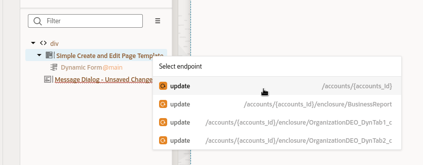

2. In the **Configure as Edit Form** page, filter on **name**, then **revenue**, and select the following fields:
	* OrganizationName
	* CEOName
	* CurrentFiscalYearPotentialRevenueAmount
	* NextFiscalYearPotentialRevenueAmount

	  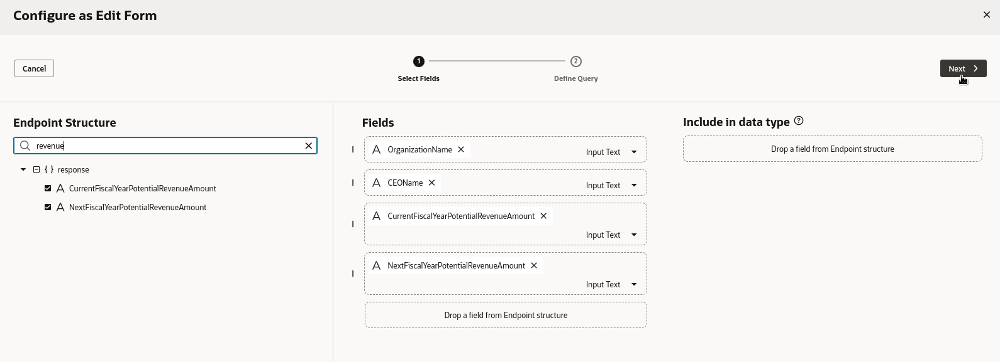

3. Click **Next**

4. Drag **objectId** from the left onto **accounts\_id** in both the **get\_accounts** and **update\_accounts** objects on the right.

	  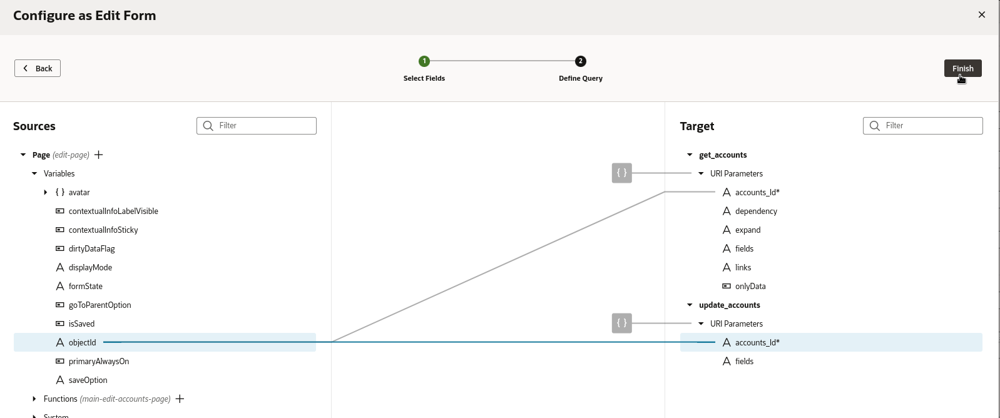

3. Click **Finish**.

	Your page should now look like this:

	  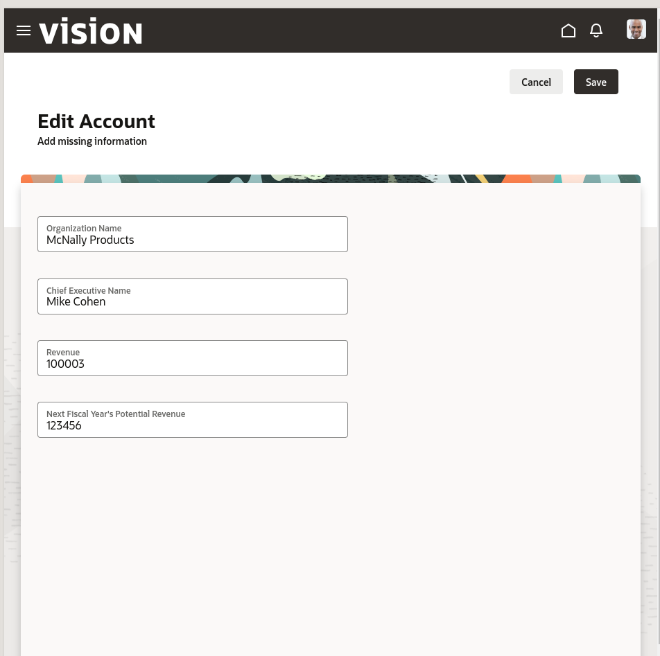

## Task 3: Configure the Save Button

When you added the **Form Layout** to the template it automatically created a save button with an action chain that includes all of the actions needed to correctly save changes.

Next you will modify the **Primary Action** (Save button) included with the **Simple Create and Edit Page Template** to use the action chain from the form's save button.

1. In the **Structure** section, click on the **Simple Create and Edit Page Template**

	  

2. In the **Properties** panel, open the **Events** tab

	  

3. Locate the **spPrimaryAction** section and click **Select** next to **Action Chain**

	  

4. Choose the **saveAccountsChain** and click **Select Action Chain**

	  

5. Under the **Input Parameters** for the Action Chain, locate **accounts** and click the **Select Variable** icon

	  

6. Choose **Page/Variables/ { } accounts**

	  

7. Under the **Input Parameters** for the Action Chain, locate **accountsId** and click the **Select Variable** icon

	  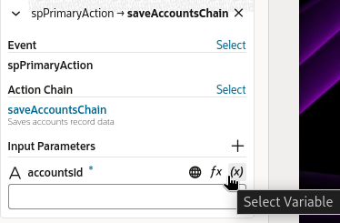

8. Choose **Page/Variables/ { } objectId** (use the filter if you have trouble locating the objectId)

	  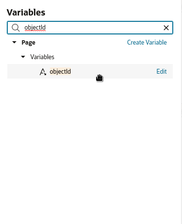

## Task 4: Add Navigation to the Action Chain

Now that the save button is configured, you will add an action to navigate back to the search page.

1. In the **spPrimaryAction** section, click on the action chain link **saveAccountsChain**

	  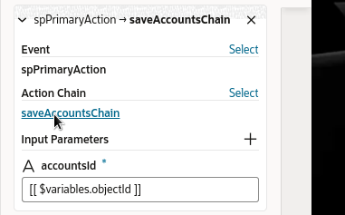

2. In the **Actions** panel on the right, locate the **Navigate Back** action

	  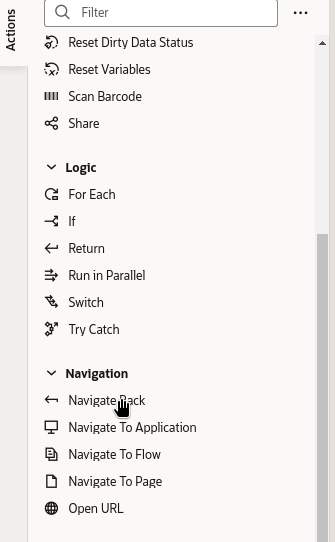

3. Drag the **Navigate Back** action onto the diagram and drop it on the line after **Reload accounts data**.  You will know you are in the correct location when you see the triangle next to the line.

	  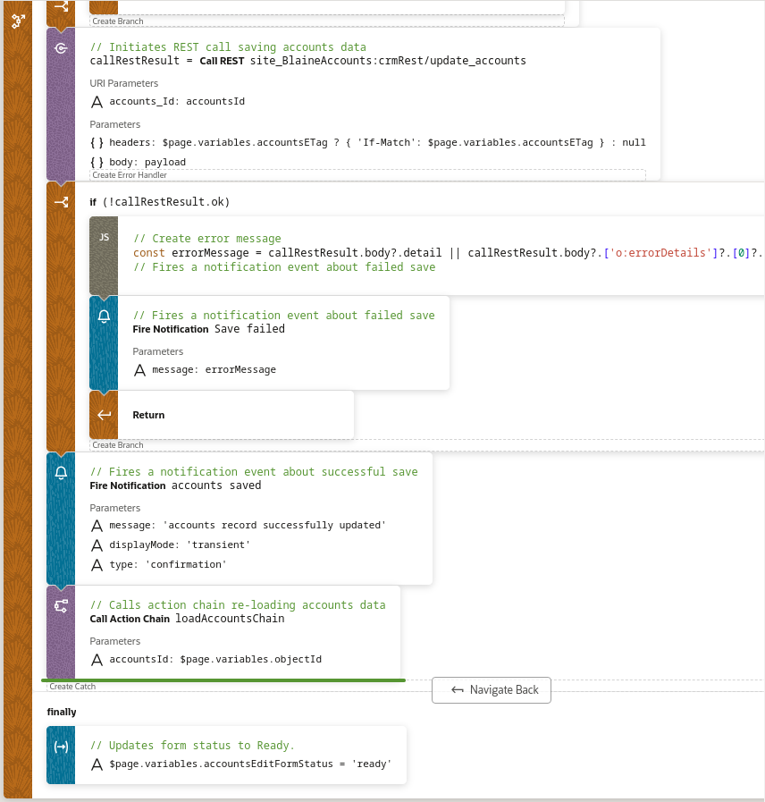

4. The action chain should look like this

	  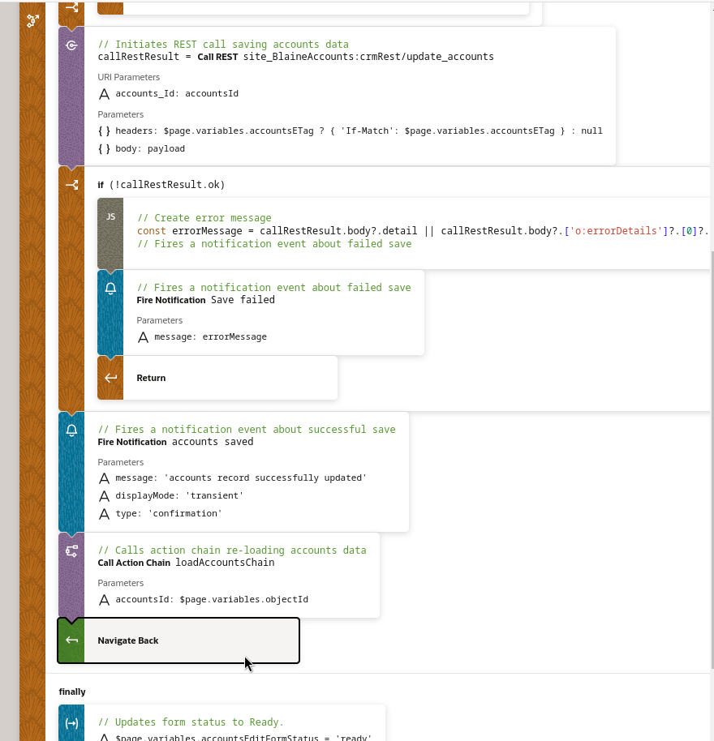

5. Switch back to the **Page Designer** tab

## Task 5: Clean up

You can now remove the unneeded objects from the page.

1. In the **Structure** tab, right-click on the Dynamic Form and click **Delete**

	  

2. In the **Confirm Delete** window, click **Delete**

	  

3. In the **Structure** tab, right-click on the Button in the toolbar and click **Delete**

	  

4. In the **Confirm Delete** window, click **Delete**

	  

## Task 6: Test your Application

1. Switch to Live mode

2. Make a modification

3. Press the **Save** button

	  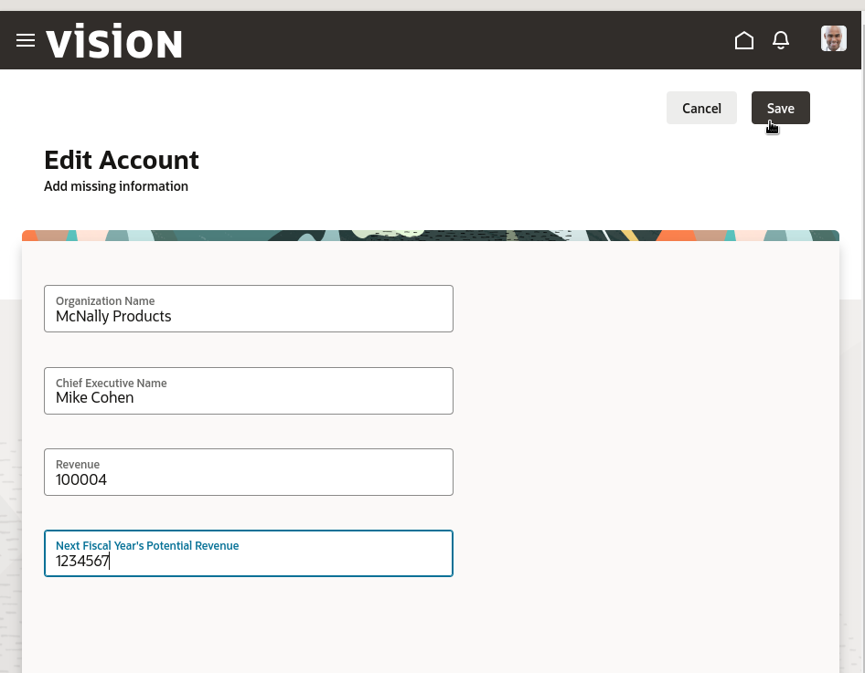

The record should be modified and you will navigate back to the **main-start** page.

4. Click **Preview** in the header to see your completed application live and experiment with its functionality.

Your work is finished! In the real world, at this point you would likely do more testing, then deploy your extension to your Oracle Fusion Cloud Applications instance. Thanks for completing this workshop!

## Learn More

* [How Do Quick Starts Work?](https://docs.oracle.com/en/cloud/paas/visual-builder/visualbuilder-building-appui/work-pages-and-flows1.html#GUID-DD40C71D-A8AE-43E2-A2F4-798AF3D49983)

## Acknowledgements
* **Author** - Shay Shmeltzer, Oracle Cloud Development Tools, September 2022
* **Contributors** -  Marcie Caccamo, Blaine Carter, Oracle Cloud Development Tools
* **Last Updated By/Date** - Blaine Carter, Oracle Cloud Development Tools, March 2023
