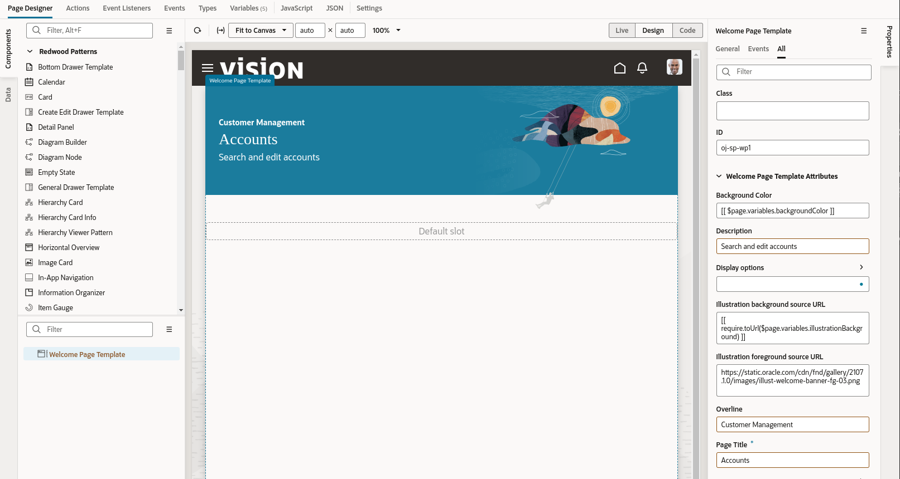
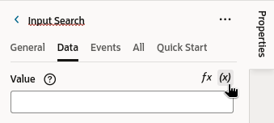
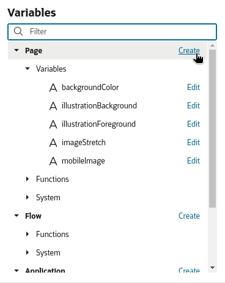
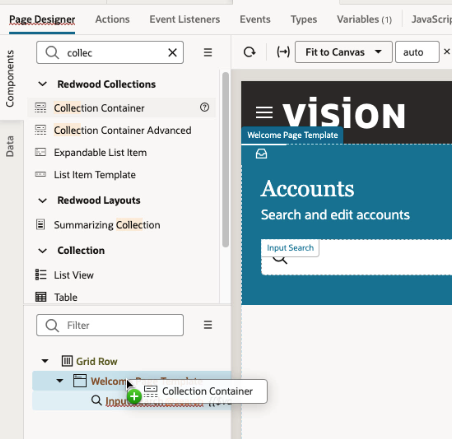

# Configure the Welcome page

## Introduction

In this lab we'll use add Oracle JET UI components to the Welcome page you created using the Redwood Welcome Page template.  Our page will display a list of accounts, and allow the list to be filtered.

Estimated Time: 15 minutes

### Objectives

In this lab, you will:
* Get familiar with the development environment
* Leverage Redwood templates and components

Before we get started, let's explore the Designer a bit.

**Tip:** There are lots of tabs you can click to expand/collapse different areas and give yourself more room to work.

  

Here are the key areas of the Designer you'll use throughout this workshop:

| # | Tab | Functionality |
| --- | --- | --- |
| 1 | Components | UI components you can add to a page, sorted into categories  |
| 2 | Data | Data objects you can work with, based on connections you create to SaaS objects |
| 3 | Structure | Hierarchical view of the page's structure  |
| 4 |Properties | Declarative area to define properties for the component selected in your page |
| 5 |Canvas | Displays a design/live view (or code view) of your page content |
{: title="Designer Regions"}

Note that you can collapse and expand tabs to better manage your working area. When collapsed the tab will show as a vertical tab on the side of the editor. To expand/collapse a tab click that specific tab.

The Components palette contains over a hundred UI components that you can drag and drop onto your pages to design your interfaces. In this workshop, we're going to leverage some page templates designed by Oracle's Redwood Design team to accelerate our application development. These templates provide a responsive user experience, which means your app will adjust to the device accessing it.

## Task 1: Configure the Welcome Page

You will configure the Welcome Page by setting some of the template properties.

1. Switch back to **main** tab:

	

2. Double-click  **main-start** to open the page in the Page Designer, one of the main visual editors in the Designer.  Then under **Structure** click on **Welcome Page Template**:

  

3. Click the **All** tab in the Properties pane and modify these properties:

| # | Property | Value |
| --- | --- | --- |
| 1 | Background Color | Choose your preferred color  |
| 2 | Description| **Search and edit accounts** |
| 3 | Illustration foreground source URL | https://static.oracle.com/cdn/fnd/gallery/2107.1.0/images/illust-welcome-banner-fg-03.png |
| 4 |Page Title | **Accounts** |
{: title="Template Properties"}

Your screen should look like this:
  

In the next lab, we'll add some more useful components to the page.

## Task 3: Add a Search Component and Define a Variable

1. In the Components palette's search box, type **search**, which will locate a component called **Input Search**.
2. Drag this component and drop it on the page in the canvas. A pop-up will appear asking which slot you want to use; choose **Search slot**:
  

	This field is where users will enter a search term to locate an account. We need to keep track of these terms, so we'll use a page variable to do that.

3. While the input search is selected in the canvas, click the **Data** tab in the Properties pane.

4. Click the little arrow at the top right of the **Value** field to display a list of variables. (you might need to hover your mouse on the field first)

  

5. Next to the **Page** category, click **Create Variable** to create a page-level variable:

  

	Notice that there are multiple scopes for variables, which helps to share their values across pages and flows in the application.

6. In the Create Variable dialog's ID field, type **searchString**, leaving the Type as String. Click **Create**:

  

The Value field in the Properties pane now contains a reference to our new variable.

## Task 4: Add a Collection Container  

In this task we'll add a container to the page, which will later hold some data we'll get from Oracle Fusion Cloud Applications.

1. In the Components palette's search box type **collection**, which will locate a component called **Collection Container**.
2. Drag this component to the Structure pane and drop it on top of the Welcome Page template:
  
3. In the slots pop-up, select **Default**:
  
The layout of our first page is now ready.  Our next step is to add some data to the page from Oracle Fusion Cloud Apps.

Notice how all of our design tasks so far have been done with simple drag and drop functionality and setting properties. This visual development approach is key to the productivity that Visual Builder Studio provides. If you prefer to work in code, however, you can always do so by clicking the Code button right above where the page preview is displayed. Any modifications you make to your page's HTML code while in Code mode are automatically reflected in Design mode, should you choose to return to it.  

At this point your screen should look like this:
  

Let's move on to the next lab, where we'll learn how to get some data from Oracle SaaS onto the page.

You may now **proceed to the next lab**.

## Learn More

* [Use the Page Designer](https://docs.oracle.com/en/cloud/paas/visual-builder/visualbuilder-building-appui/get-started1.html#GUID-CC2B203D-51D3-4408-8D0B-4E26C86BCBC0)
* [Oracle JET](http://oracle.com/jet)

## Acknowledgements
* **Author** - Shay Shmeltzer, Oracle Cloud Development Tools, August 2022
* **Contributors** -  Marcie Caccamo, Blaine Carter, Oracle Cloud Development Tools
* **Last Updated By/Date** - Blaine Carter, Oracle Cloud Development Tools, March 2023
